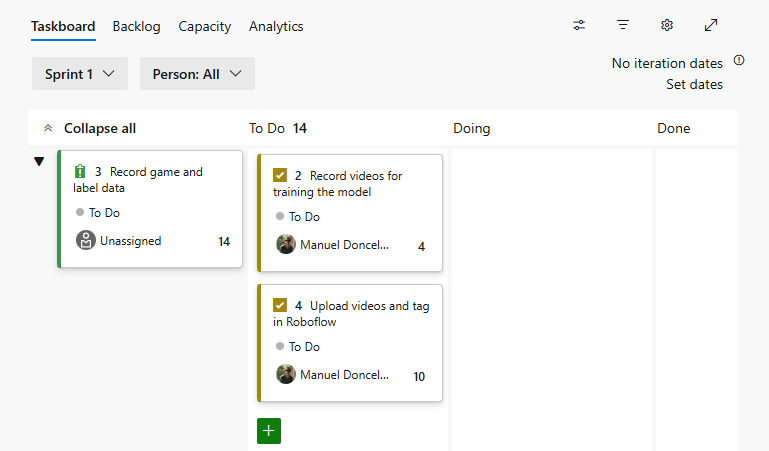

# Dev Azure Utilities

Chrome extension with utilities to facilitate the interaction with dev.azure.com

## Chrome-Extension

Inside [chrome-extension](./chrome-extension) there is a Chrome Extension with the features described in [features](#features)

### How To Install It

+ Clone the repository
+ Add the extension to Chrome (for more info check [this](https://developer.chrome.com/docs/extensions/get-started/tutorial/hello-world))
  + Open Chrome and write chrome: `chrome://extensions`
  + Enable `developer mode`
  + Click on `Load unpacked`
  + Check that the extension is installed

### Features

#### Copy Branch Name From Work Item

When you are in a Azure Sprint (url matching https://dev.azure.com/../_sprints/taskboard/../Sprint%201), it's possible, by double-clicking on the expandable button of a task, to copy to the clipboard the branch name that can be used to develop that task.
The branch name is created by following this pattern: `feature/${parent_work_item_id}/${task-text}`.

So if we check the image, the text copied to the clipboard for the *task number 4* would be: `feature/3/Upload-videos-and-tag-in-Roboflow`

## TODO

- Ability to personalize branch name strategy

